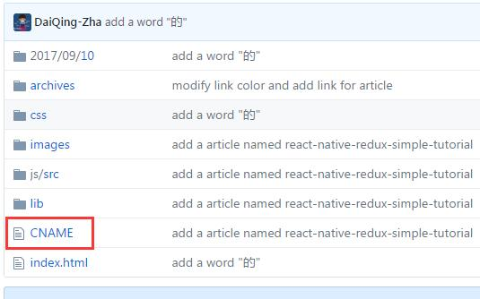
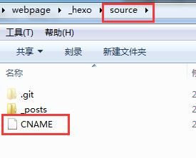

一直想着在github上建一个自己的博客网站，刚好这个周末有空就开始实施了，经过两天努力博客终于是建好了，也达到了想要的效果，但是其中一系列的坑让人不舒服，为此专门记录下来给那些需要的人一些参考。

首先关于如何建站参考以下几篇文章：  
1、[手把手教你建github技术博客](http://www.jianshu.com/p/701b1095da11) 
2、[如何在 GitHub 上写博客？](https://www.zhihu.com/question/20962496) 
3、[手把手教你用Hexo+Github 搭建属于自己的博客](http://blog.csdn.net/gdutxiaoxu/article/details/53576018) 

### 1、文章左侧的目录如何弄出来
如图文章左侧的目录是如何弄出来的：  
1、首先在你的markdown文件里面要有标题，所谓标题就是例如这种一级标题(#)，二级标题(##)，三级标题(###)的。  
2、在主题的_config文件里面，将toc的enable设置为true就ok了，默认的目录是有序号的，如果你不想要序号，你就把number置为false
  
### 2、hexo生成博文插入图片显示不出来
显示图片是一个大坑，解决步骤如下：  
1、把主页配置文件_config.yml 里的post_asset_folder:这个选项设置为true  
2、在你的hexo目录下执行这样一句话npm install hexo-asset-image --save，**这是下载安装一个可以上传本地图片的插件**  
3、等待一小段时间后，再运行hexo n "xxxx"来生成md博文时，/source/_posts文件夹内除了xxxx.md文件还有一个同名的文件夹  
4、最后在xxxx.md中想引入图片时，先把图片复制到xxxx这个文件夹中，然后只需要在xxxx.md中按照markdown的格式引入图片：````  
5、最后检查一下，hexo g生成页面后，进入public\2017\09\10\index.html文件中查看相关字段，可以发现，html标签内的语句是````，而不是````。这很重要，关乎你的网页是否可以真正加载你想插入的图片。  
### 3、文字显示成了德文
在根目录下的_config文件里面，默认语言是空的，本以为默认会显示英文。但是经过hexo g ,hexo d 后，生成的本地网页上有时候显示的是德文（刚开始还以为是乱码），有时候显示的是却是英文，这就很蛋疼，显示英文很好理解，因为国际语言就是英语，但是显示德文就有点坑了，后来才发现，在next主题的语言包文件夹下德语的配置文件de.yml是排在第一位的，估计是这原因导致它显示德语，所以最好的办法就是明确指出语言为英语或者汉语，不要默认让它空着。  

```
title: Charles
subtitle: 有人说我是假程序员
description:
author: Charles
language: en
timezone:
```

### 4、hexo中next主题代码高亮无法正常显示
我们知道在markdown里面代码块使用两个反三点包起来的，一般的md编译器都会显示高亮的，但是在next主题里面就不会，解决办法就是在第一个反三点的右边加上你所使用的语言，例如java，C++，jsx等等    

### 5、部署代码到github上时提示 deloyer not found:git
解决办法：  
注意需要提前安装一个扩展：
npm install hexo-deployer-git --save
### 6、每次deploy都要配置域名
因为我配置的自己的域名，所以在我的github库里面有一个CNAME文件,如下图所示：
  
但是我每次执行hexo deploy之后，CNAME文件都没有了，搞得每次都要去Settings--->GitHub Pages--->Custom domain下面去重新配置域名，解决办法为，将你的CNAME文件放到本地的source文件夹下，如下图：
